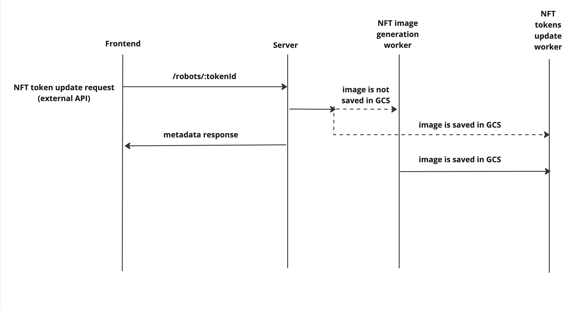

# Super robots app by Superdao

## What is this project?

The project was created in order for each user to receive the NFT of their unique robot for free, which would develop along with the user's wallet and be customized with new unique spare parts personalized for the user.
At the final stage of the life of the project, we received 10 versions of Robot parts (each new version requires updating the entire collection on Opensea), ~180k nft in the collection as a whole and a referral program that allows any user to invite their friends to get their unique Robot unlimitedly. Total possible robot variations: 1.865.023.488 (1 billion 865 million 23 thousand 488 variations)

## First actions

- Install project dependencies - `pnpm install`
- Launch services - `docker-compose up -d`
- Complete and copy the configuration file - `cp .env.example .env`
- Synchronize the data schema with the database - `pnpm migrate`
- Generate graphql types - `pnpm codegen`
- Run the server in development mode - `pnpm dev`

## Tech stack

### Frontend

- Typescript
- React + ecosystem
- Next.js (SSR)
- React-Query + graphql type generation
- TailwindCSS
- Unleash

### Backend

- Typescript
- Nest.js (express.js)
- Prometheus
- Typeorm
- Unleash
- Sharp
- Ethers

### Blockchain
- Solidity
- Hardhat
- OpenZeppelin
 
### External dependencies

- Redis
- PostgreSQL
- RabbitMQ
- Kafka
- GCS
- Mailgun
- Scoring API (Superdao project)
- OG preview generator (Superdao project)
- The Graph (Superdao deployment and parse rules)

### Deploy

- Docker (dev)
- Kubernetes (stage/review/prod)

## How it works?

### Generally

**We have 4 important flow data:**

1. **Data exchange between the frontend and backend of the application (internal API)**
2. **Mint NFT Robot**
3. **Customization of the NFT robot**
4. **Updating NFT robot metadata**

In short:

1. The task of data exchange is solved in the classic Web2 format: we have a horizontally and vertically scalable front-end and back-end application that exchanges data in the REST and graph style, there is nothing particularly interesting here, except for type generation, which allows you to always keep the actual data types between the back-end and front-end

- [more info](#data-exchange-internal-api)

2. The task of a mint robot is solved by asynchronous generation of a picture and a mint based on crown workers, such an architecture allows achieving the MAXIMUM POSSIBLE performance of a mint nft for a specific NFT contract with 1 signer wallet and can develop to the MAXIMUM PERFORMANCE solution that CAN ALLOW BLOCKCHAIN in principle - we can make a system with several wallets and signers and buy back all the gas available in the block and all blocks in a row (limited by block size and gas cost) 

- [more info](#mint-of-the-nft-robot)
- [MINT Worker README](./apps/superdao-backend/src/services/erc721MintWorker/README.md)
- [Image generation Worker README (old)](./apps/superdao-backend/src/services/robotImageGenerationWorker/README.md)

3. The solution to the task of customizing the robot is based on similar principles: there are asynchronous workers for generating images and then updating the token on Opensea (Inside the NFT platform, they exist in the form of decomposed layers, which allows you to get any image without generating it at any available time) 

- [more info](#customization-of-the-nft-robot)
- [Token Update Worker README](./apps/superdao-backend/src/services/tokenUpdateWorker/README.md)
- [Image generation Worker README (old)](./apps/superdao-backend/src/services/robotImageGenerationWorker/README.md)

4. The solution to the task of updating the NFT robot metadata is based on the same principles: there is an asynchronous image generation worker, if generation is necessary, the "Updating" Robot is returned. The main difference is the fact that this flow belongs to the external API and is built according to REST, this endpoint is used to update the collection on Opensea. When versioning of robot parts occurs (now is 10-th version), the entire collection needs to be updated through this flow (~180k NFT at the same time)

[more info here](#updating-nft-robot-metadata)
- [Token Update Worker README](./apps/superdao-backend/src/services/tokenUpdateWorker/README.md)
- [Image generation Broker Worker README (new)](./apps/superdao-backend/src/services/robotImageGenerationBrokerWorker/README.md)

## How it looks like?

## Detailed information

### Mint of the NFT Robot

In order, what happens when the user wants to mint the Robot NFT:

1. we validate whether this is possible (whether mint is available to the user, whether he minted NFT earlier, etc.)
2. We collect data of the user's wallet in an external service with data from the blockchain
3. based on the hash sum of the wallet, the data from point 2 and the current version of the robot’s parts, we get a set of layers from which the image for the NFT is formed, and then we calculate this image hash sum
4. Check if there is a picture with such a hash in GCS, if there is, put it in a specially dedicated Sorted set with a key for NFT mint CRON worker in Redis, if not, put it in a specially dedicated Sorted set with a key for Image generation CRON worker in Redis (with a special field “withMint: true”, signaling to the generation worker that after it generates an image and saves it to the cloud, it is necessary to put it in a specially dedicated Sorted set with a key for NFT mint CRON worker entry to mint of this NFT)
5. If necessary, we generate a picture, save it to the cloud and put the mint entry in Redis
6. Mint NFT, parse transaction logs and save data in PSQL, to which wallet which token belongs

As a result, we get a flow that can withstand any load, because when mint is requested, it instantly returns NFT as a set of layers (pictures of Robot parts) and asynchronously registers the need to generate a combined asset and mint NFT

**Image generation CRON worker** - based on Redis (this is an old version, there is a version with increased performance based on RabbitMQ, it is presented in more detail in [this section](#updating-nft-robot-metadata)), guarantees that before any action with NFT, a picture for it will be generated and then sent to the desired flow

**NFT mint CRON worker** - based on Redis, provides the functionality of a wallet nonce manager, guarantees the current and most optimal gas price in terms of price / speed ratio, guarantees 100% sending of 1 nft to 1 address, guarantees data saving during a crash / restart and allows for one batch-transaction send X NFT (using the upper limit of 75 NFT, which occupies the entire block), it is thanks to this functionality that we can afford to achieve MAXIMUM performance for 1 wallet, and after improving the structure - MAXIMUM performance on the blockchain (repurchase of N full blocks in a row)

**What needs to be done to get the MAXIMUM performance for a contract with 1 signer wallet**: Just inject a new image generation worker based on RabbitMQ and not on Redis into this flow (it is already ready and presented in more detail in [this section](#updating-nft-robot-metadata)). Its implementation will allow generating a large number (N > 75) of images for NFT and fully loading the mint worker, which will buy entire blocks for NFT minting

**What needs to be done in theory to achieve MAXIMUM performance on the blockchain (N signer wallets)**: In the flow above, it is necessary to raise the number of replicas of the generation worker to such a number that all N replicas of the mint worker will be fully loaded (can be understood as 75 * N replicas), then you need to update the mint worker and transfer the implementation from Redis to RabbitMQ + Redis (Mint entries are transferred to RabbitMQ, wallet-based mutex remains in Redis because the wallet is already busy redeeming the mint block), this will allow infinitely upload block-sized transactions to Mempool and only the gas cost we are willing to pay - decides how fast the transaction will be accepted into the block

### Data exchange (Internal API)

In order, what happens when a user sends a request from the platform:

1. we validate the request input
2. we take the necessary data from the cache / database
3. save the necessary data to the cache / database

### Updating NFT Robot Metadata

In order, what happens when User wants to refresh a Robot token:

1. we validate if it is possible (whether the token is minted)
2. We get the token minter wallet from the database
3. We collect data on the user's wallet in an external service with data from the blockchain
4. based on the hash sum of the wallet, the data from point 3 and the current version of the robot’s spare parts, we get a set of layers from which an image for the NFT is formed, and then we calculate this image hash sum
5. Check if there is a picture with such a hash in the GCS, if there is, put it in a specially dedicated Sorted set with a key for NFT token update CRON worker in Redis, if not, put the entry for generating an image for NFT into the RabbitMQ queue (with with the special field withUpdate: true, which signals to the generation worker that after it generates the image and saves it to the cloud, it is necessary to put it in a specially dedicated Sorted set with the key for the NFT token update CRON worker to update this NFT)
6. If necessary, we generate a picture, save it to the cloud and put an entry to update the token in Redis
7. Update the NFT token on Opensea

As a result, we get a flow that can withstand any load (160k NFT will be updated in 100 replicas of such a generation worker in ~25 minutes), because we can horizontally scale the generation worker indefinitely, the token update worker will update the NFT at the Opensea side as soon as possible (if the metadata of the robot contains information that a picture for the NFT is being generated and not available at the moment - instead of the picture of the robot, an animation of the updating robot is shown)

Through this flow, the entire NFT collection on Opensea is updated when versioning of robot parts occurs (now it is 180k NFT at the same time and 10-th parts version)

**Image generation CRON worker** (updated version regarding implementation on Redis) - based on RabbitMQ and has much higher performance (because of horizontally scaling), it also guarantees that before any action with NFT, a picture for it will be generated and then sent to the desired flow

**NFT token update CRON worker** - based on Redis, gives the functionality of updating the NFT token and subsequent synchronization of the status of the token on the platform (if it is necessary to sync the update status of the NFT to the desired value, as in [this case](#customization-of-the-nft-robot))

### Customization of the NFT Robot

In order, what happens when a user wants to customize a Robot token:

1. we validate if this is possible (whether the token is minted, whether the user is the owner of the token etc)
2. We get the token minter wallet from the database
3. We collect data on the user's wallet in an external service with data from the blockchain
4. Update the parts of the current Robot
5. based on the hash sum of the wallet, the data from point 3 and the current version of the robot’s spare parts, we get a set of layers from which an image for the NFT is formed, and then we calculate this image hash sum
6. Check if there is a picture with such a hash in the GCS, if so, put it in a dedicated Sorted set with a key for NFT token update CRON worker in Redis, if not, put it in a dedicated Sorted set with a key for Image generation CRON worker in Redis (with a special field “withUpdate: true”, signaling to the generation worker that after it generates an image and saves it to the cloud, it must put update entry in a specially dedicated Sorted set with a key for NFT token update CRON worker entry to update this NFT)
7. If necessary, we generate a picture, save it to the cloud and put the token update entry in Redis
8. Update the NFT token on Opensea

As a result, we get a flow that can withstand any load, because customization flow instantly returns NFT as a set of layers (pictures of Robot parts) and asynchronously registers the need to generate an asset and update NFT, the flow also shows the NFT status as “updating” and supports its automatic updating and subsequent status synchronization

**Image generation CRON worker** - based on Redis (this is an old version, there is a version with increased performance based on RabbitMQ, it is presented in more detail in [this section](#updating-nft-robot-metadata), guarantees that before any action with NFT, a picture for it will be generated and then sent to the desired flow

**NFT token update CRON worker** - based on Redis, gives the functionality of updating the NFT token and subsequent synchronization of the token status on the platform

## Detailed information about blockchain part of [SuperRobots NFT collection](https://opensea.io/collection/super-robots-by-superdao)
- Collection is built on a pretty standart upgradable (Beacon Proxy) ERC721 contracts system
- Collection is built using audited contracts (ERC721Upgradeable, OwnableUpgradeable, UpgradeableBeacon, BeaconProxy contracts) from OpenZeppelin library
- Collection is deployed to Polygon network
  - [NFT collection's proxy contract](https://polygonscan.com/token/0xdcfa55e5581b1e3f04ac752c08692eacaa509d9e)
  - [NFT collection's upgradeable beacon contract](https://polygonscan.com/address/0xadf775520d065f1861ec194c27baf23eb297b221)
  - [NFT collection's current implementaton contract](https://polygonscan.com/address/0x7cf96059381663cf81d7a3f3d16dac911fc761cd)

## Contributors

We are posting a repository with no commit history, so here is a list of developers, testers and devops who contributed

Aleksandr Antsiferov,
Aleksandr Khaustov,
Anna Linnik,
Anton Movshin,
Eduard Tishkin,
German Iskhakov,
Maxim Kochukov,
Vladimir Vlasiuk,
Nazhmudin Baymurzaev
